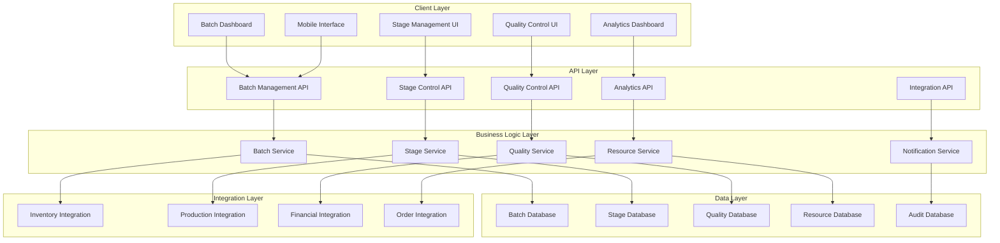
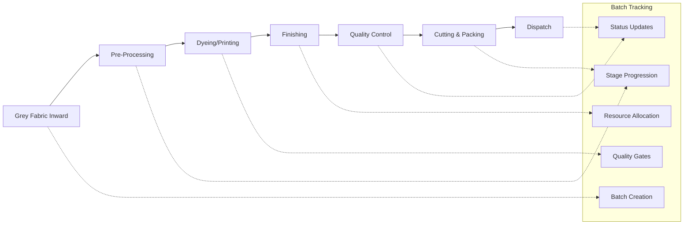

# Design Document

## Overview

The Batch Lifecycle Management System is designed as a comprehensive solution that tracks production batches through all stages of textile manufacturing. The system integrates with existing ERP modules and provides real-time visibility, quality control, resource management, and analytics across the entire production flow.

## Architecture

### System Architecture



### Production Flow Integration



## Components and Interfaces

### 1. Batch Management Core

#### BatchService
```typescript
interface BatchService {
  createBatch(data: CreateBatchRequest): Promise<Batch>
  getBatch(id: string): Promise<Batch>
  updateBatch(id: string, data: UpdateBatchRequest): Promise<Batch>
  deleteBatch(id: string): Promise<void>
  getBatches(filters: BatchFilters): Promise<PaginatedBatches>
  
  // Stage Management
  moveToNextStage(batchId: string, stageData: StageTransitionData): Promise<Batch>
  holdBatch(batchId: string, reason: string): Promise<Batch>
  resumeBatch(batchId: string, notes: string): Promise<Batch>
  
  // Resource Management
  assignResources(batchId: string, resources: ResourceAssignment[]): Promise<Batch>
  updateResourceUtilization(batchId: string, utilization: ResourceUtilization): Promise<Batch>
  
  // Cost Tracking
  addCosts(batchId: string, costs: BatchCost[]): Promise<Batch>
  calculateTotalCost(batchId: string): Promise<CostBreakdown>
}
```

#### StageService
```typescript
interface StageService {
  initializeStage(batchId: string, stageNumber: number): Promise<BatchStage>
  startStage(batchId: string, stageNumber: number, data: StageStartData): Promise<BatchStage>
  updateStageProgress(batchId: string, stageNumber: number, progress: StageProgress): Promise<BatchStage>
  completeStage(batchId: string, stageNumber: number, data: StageCompletionData): Promise<BatchStage>
  
  // Quality Integration
  performQualityCheck(batchId: string, stageNumber: number, qualityData: QualityCheck): Promise<QualityResult>
  
  // Material Tracking
  consumeMaterials(batchId: string, stageNumber: number, materials: MaterialConsumption[]): Promise<void>
  recordOutput(batchId: string, stageNumber: number, output: StageOutput): Promise<void>
}
```

### 2. Stage-Specific Components

#### Grey Fabric Inward Stage
```typescript
interface GreyFabricInwardStage {
  receiveGreyFabric(data: GreyFabricReceipt): Promise<BatchStage>
  performIncomingQC(batchId: string, qcData: IncomingQualityCheck): Promise<QualityResult>
  allocateToWarehouse(batchId: string, allocation: WarehouseAllocation): Promise<void>
  generateGRN(batchId: string): Promise<GRN>
}
```

#### Pre-Processing Stage
```typescript
interface PreProcessingStage {
  setupProcess(batchId: string, processType: ProcessType, recipe: ChemicalRecipe): Promise<BatchStage>
  startDesizing(batchId: string, parameters: ProcessParameters): Promise<ProcessResult>
  startBleaching(batchId: string, parameters: ProcessParameters): Promise<ProcessResult>
  startScouring(batchId: string, parameters: ProcessParameters): Promise<ProcessResult>
  startMercerizing(batchId: string, parameters: ProcessParameters): Promise<ProcessResult>
  monitorProcess(batchId: string, readings: ProcessReadings): Promise<void>
  completeProcess(batchId: string, results: ProcessResults): Promise<BatchStage>
}
```

#### Dyeing/Printing Stage
```typescript
interface DyeingPrintingStage {
  setupDyeing(batchId: string, colorRecipe: ColorRecipe): Promise<BatchStage>
  setupPrinting(batchId: string, printDesign: PrintDesign): Promise<BatchStage>
  startColorProcess(batchId: string, parameters: ColorParameters): Promise<ProcessResult>
  monitorColorProcess(batchId: string, readings: ColorReadings): Promise<void>
  performColorMatching(batchId: string, standards: ColorStandards): Promise<ColorMatchResult>
  completeColorProcess(batchId: string, results: ColorResults): Promise<BatchStage>
}
```

#### Finishing Stage
```typescript
interface FinishingStage {
  setupStenter(batchId: string, stenterSettings: StenterSettings): Promise<BatchStage>
  setupCoating(batchId: string, coatingSpecs: CoatingSpecifications): Promise<BatchStage>
  startFinishing(batchId: string, parameters: FinishingParameters): Promise<ProcessResult>
  monitorFinishing(batchId: string, readings: FinishingReadings): Promise<void>
  performFinishingQC(batchId: string, qcData: FinishingQualityCheck): Promise<QualityResult>
  completeFinishing(batchId: string, results: FinishingResults): Promise<BatchStage>
}
```

#### Quality Control Stage
```typescript
interface QualityControlStage {
  setupQualityPlan(batchId: string, qualityPlan: QualityPlan): Promise<BatchStage>
  performInspection(batchId: string, inspection: QualityInspection): Promise<InspectionResult>
  conductTests(batchId: string, tests: QualityTest[]): Promise<TestResult[]>
  evaluateResults(batchId: string, evaluation: QualityEvaluation): Promise<QualityDecision>
  generateQualityCertificate(batchId: string): Promise<QualityCertificate>
}
```

#### Cutting & Packing Stage
```typescript
interface CuttingPackingStage {
  setupCuttingPlan(batchId: string, cuttingPlan: CuttingPlan): Promise<BatchStage>
  startCutting(batchId: string, parameters: CuttingParameters): Promise<CuttingResult>
  applyLabels(batchId: string, labelData: LabelData): Promise<void>
  packIntoCartons(batchId: string, packingData: PackingData): Promise<PackingResult>
  generatePackingList(batchId: string): Promise<PackingList>
  prepareForDispatch(batchId: string): Promise<DispatchPreparation>
}
```

### 3. Quality Management Integration

#### QualityService
```typescript
interface QualityService {
  createQualityPlan(batchId: string, stageNumber: number, plan: QualityPlan): Promise<QualityPlan>
  performQualityCheck(batchId: string, stageNumber: number, check: QualityCheck): Promise<QualityResult>
  recordTestResults(batchId: string, stageNumber: number, results: TestResult[]): Promise<void>
  evaluateQuality(batchId: string, stageNumber: number, criteria: QualityCriteria): Promise<QualityDecision>
  generateQualityReport(batchId: string): Promise<QualityReport>
  
  // Quality Gates
  checkQualityGate(batchId: string, stageNumber: number): Promise<GateResult>
  approveQualityGate(batchId: string, stageNumber: number, approval: QualityApproval): Promise<void>
  rejectQualityGate(batchId: string, stageNumber: number, rejection: QualityRejection): Promise<void>
}
```

### 4. Resource Management

#### ResourceService
```typescript
interface ResourceService {
  allocateMachine(batchId: string, stageNumber: number, machineId: string, duration: number): Promise<MachineAllocation>
  allocateOperator(batchId: string, stageNumber: number, operatorId: string, hours: number): Promise<OperatorAllocation>
  allocateTools(batchId: string, stageNumber: number, tools: ToolAllocation[]): Promise<void>
  
  // Utilization Tracking
  recordMachineUtilization(allocationId: string, utilization: MachineUtilization): Promise<void>
  recordOperatorTime(allocationId: string, timeEntry: OperatorTimeEntry): Promise<void>
  
  // Efficiency Monitoring
  calculateEfficiency(batchId: string, stageNumber: number): Promise<EfficiencyMetrics>
  generateUtilizationReport(filters: UtilizationFilters): Promise<UtilizationReport>
}
```

### 5. Analytics and Reporting

#### AnalyticsService
```typescript
interface AnalyticsService {
  getBatchPerformanceMetrics(filters: PerformanceFilters): Promise<PerformanceMetrics>
  getStageAnalytics(stageNumber: number, filters: StageFilters): Promise<StageAnalytics>
  getQualityTrends(filters: QualityFilters): Promise<QualityTrends>
  getCostAnalysis(filters: CostFilters): Promise<CostAnalysis>
  getEfficiencyReport(filters: EfficiencyFilters): Promise<EfficiencyReport>
  
  // Real-time Dashboards
  getRealTimeDashboard(): Promise<DashboardData>
  getStageStatusSummary(): Promise<StageStatusSummary>
  getAlerts(): Promise<Alert[]>
}
```

## Data Models

### Core Batch Model
```typescript
interface Batch {
  _id: string
  companyId: string
  batchNumber: string
  productionOrderId?: string
  customerOrderId?: string
  
  // Basic Information
  productType: string
  productSpecifications: ProductSpecifications
  plannedQuantity: number
  actualQuantity?: number
  unit: string
  
  // Status and Progress
  status: BatchStatus
  currentStage: number
  progress: number
  priority: Priority
  
  // Stages
  stages: BatchStage[]
  
  // Quality
  qualityGrade?: QualityGrade
  qualityScore?: number
  qualityIssues: QualityIssue[]
  
  // Resources
  resourceAllocations: ResourceAllocation[]
  
  // Costs
  costs: BatchCost[]
  totalCost?: number
  costPerUnit?: number
  
  // Timeline
  plannedStartDate: Date
  actualStartDate?: Date
  plannedEndDate: Date
  actualEndDate?: Date
  
  // Audit
  createdBy: string
  createdAt: Date
  updatedAt: Date
  
  // Integration
  inventoryTransactions: InventoryTransaction[]
  productionFlowId?: string
}
```

### Stage Model
```typescript
interface BatchStage {
  stageNumber: number
  stageName: string
  stageType: StageType
  
  // Status
  status: StageStatus
  progress: number
  
  // Timeline
  plannedStartTime?: Date
  actualStartTime?: Date
  plannedEndTime?: Date
  actualEndTime?: Date
  duration?: number
  
  // Resources
  machineAllocations: MachineAllocation[]
  operatorAllocations: OperatorAllocation[]
  toolAllocations: ToolAllocation[]
  
  // Materials
  inputMaterials: MaterialInput[]
  outputMaterials: MaterialOutput[]
  consumedMaterials: MaterialConsumption[]
  
  // Process Parameters
  processParameters: ProcessParameters
  actualParameters?: ProcessParameters
  
  // Quality
  qualityChecks: QualityCheck[]
  qualityResults: QualityResult[]
  
  // Costs
  stageCosts: StageCost[]
  
  // Notes and Issues
  notes: string[]
  issues: StageIssue[]
  
  // Audit
  startedBy?: string
  completedBy?: string
}
```

### Quality Model
```typescript
interface QualityCheck {
  _id: string
  batchId: string
  stageNumber: number
  checkType: QualityCheckType
  
  // Check Details
  checkDate: Date
  checkedBy: string
  checkMethod: string
  
  // Parameters
  parameters: QualityParameter[]
  
  // Results
  results: QualityResult[]
  overallGrade: QualityGrade
  overallScore: number
  
  // Decision
  decision: QualityDecision
  notes: string
  
  // Actions
  correctiveActions: CorrectiveAction[]
  
  // Approval
  approvedBy?: string
  approvalDate?: Date
}
```

## Error Handling

### Error Types
```typescript
enum BatchErrorType {
  BATCH_NOT_FOUND = 'BATCH_NOT_FOUND',
  INVALID_STAGE_TRANSITION = 'INVALID_STAGE_TRANSITION',
  RESOURCE_NOT_AVAILABLE = 'RESOURCE_NOT_AVAILABLE',
  QUALITY_GATE_FAILED = 'QUALITY_GATE_FAILED',
  INSUFFICIENT_MATERIALS = 'INSUFFICIENT_MATERIALS',
  MACHINE_BREAKDOWN = 'MACHINE_BREAKDOWN',
  OPERATOR_UNAVAILABLE = 'OPERATOR_UNAVAILABLE',
  PROCESS_PARAMETER_OUT_OF_RANGE = 'PROCESS_PARAMETER_OUT_OF_RANGE'
}
```

### Error Handling Strategy
1. **Validation Errors**: Return 400 with detailed field-level errors
2. **Business Logic Errors**: Return 422 with business rule violations
3. **Resource Conflicts**: Return 409 with conflict resolution options
4. **System Errors**: Return 500 with error tracking and notification
5. **Integration Errors**: Implement retry logic with exponential backoff

## Testing Strategy

### Unit Testing
- Test all service methods with mock dependencies
- Test data model validation and business rules
- Test error handling and edge cases
- Achieve 90%+ code coverage

### Integration Testing
- Test API endpoints with real database
- Test integration with existing ERP modules
- Test real-time updates and notifications
- Test concurrent batch operations

### Performance Testing
- Load test with 1000+ concurrent batches
- Test database query performance
- Test real-time update performance
- Test mobile interface responsiveness

### User Acceptance Testing
- Test complete batch lifecycle workflows
- Test quality control processes
- Test resource allocation scenarios
- Test reporting and analytics features

## Security Considerations

### Authentication and Authorization
- JWT-based authentication for all API endpoints
- Role-based access control for batch operations
- Company-level data isolation
- Audit logging for all batch modifications

### Data Protection
- Encrypt sensitive batch data at rest
- Secure API communications with HTTPS
- Implement data retention policies
- Regular security audits and penetration testing

### Compliance
- Maintain complete audit trails for regulatory compliance
- Implement data backup and recovery procedures
- Ensure GDPR compliance for personal data
- Support industry-specific compliance requirements